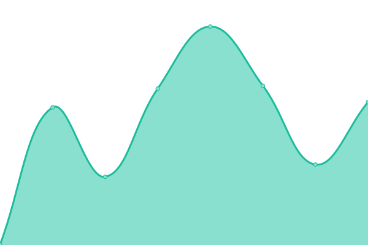

# [📈 Live Status](https://shijir0927.github.io/bk-status-page): <!--live status--> **🟩 All systems operational**

This repository contains the open-source uptime monitor and status page for [Brian Bat-Enkh](shijirbat.com), powered by [Upptime](https://github.com/upptime/upptime).

With [Upptime](https://upptime.js.org), you can get your own unlimited and free uptime monitor and status page, powered entirely by a GitHub repository. We use [Issues](https://github.com/shijir0927/bk-status-page/issues) as incident reports, [Actions](https://github.com/shijir0927/bk-status-page/actions) as uptime monitors, and [Pages](https://shijir0927.github.io/bk-status-page) for the status page.

<!--start: status pages-->
<!-- This summary is generated by Upptime (https://github.com/upptime/upptime) -->
<!-- Do not edit this manually, your changes will be overwritten -->
<!-- prettier-ignore -->
| URL | Status | History | Response Time | Uptime |
| --- | ------ | ------- | ------------- | ------ |
|  [BackerKit Crowdfunding](https://www.backerkit.com/) | 🟩 Up | [backer-kit-crowdfunding.yml](https://github.com/shijir0927/bk-status-page/commits/HEAD/history/backer-kit-crowdfunding.yml) | 

 320ms
     
 | 

<a href="https://shijir0927.github.io/bk-status-page/history/backer-kit-crowdfunding">100.00%</a>
    

|  [BackerKit Blog](https://www.backerkit.com/blog/) | 🟩 Up | [backer-kit-blog.yml](https://github.com/shijir0927/bk-status-page/commits/HEAD/history/backer-kit-blog.yml) | 

 94ms
     
 | 

<a href="https://shijir0927.github.io/bk-status-page/history/backer-kit-blog">100.00%</a>
    

|  [BackerKit BackerTracker](https://www.backerkit.com/backertracker) | 🟩 Up | [backer-kit-backer-tracker.yml](https://github.com/shijir0927/bk-status-page/commits/HEAD/history/backer-kit-backer-tracker.yml) | 

 281ms
     
 | 

<a href="https://shijir0927.github.io/bk-status-page/history/backer-kit-backer-tracker">100.00%</a>
    

|  [BackerKit Help Center](https://help.backerkit.com/) | 🟩 Up | [backer-kit-help-center.yml](https://github.com/shijir0927/bk-status-page/commits/HEAD/history/backer-kit-help-center.yml) | 

 291ms
     
 | 

<a href="https://shijir0927.github.io/bk-status-page/history/backer-kit-help-center">100.00%</a>
    

<!--end: status pages-->

[**Visit our status website →**](https://shijir0927.github.io/bk-status-page)

## 📄 License

- Powered by: [Upptime](https://github.com/upptime/upptime)
- Code: [MIT](./LICENSE) © [Anand Chowdhary](https://anandchowdhary.com), supported by [Pabio](https://pabio.com)
- Data in the `./history` directory: [Open Database License](https://opendatacommons.org/licenses/odbl/1-0/)
